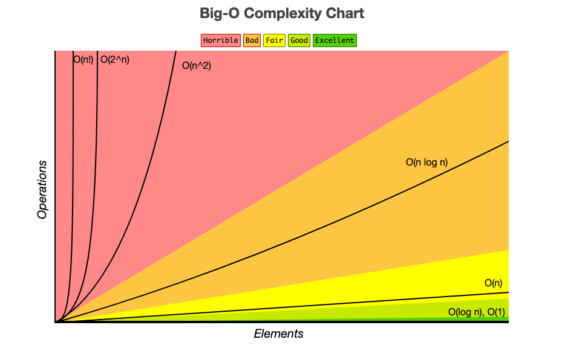

# Introduction to Data Structures and Algorithms

## Why Data Structures Matter

Data refers to the information that a program processes and manipulates. It can take various forms, such as numbers, text, or complex structures like objects. Data is the foundation of any program and serves as the input and output for different operations.

Data structures provide a structured way to store and organize data. They act as containers that hold and manage information in a program. Think of data structures as tools or systems that help us store and access data efficiently.

Data structures in programming allow us to arrange and access data in a way that enhances efficiency and simplifies our work processes.

One of the most fundamental and widely used data structures is the array. Arrays are versatile and provide a foundation for many other data structures and algorithms. They offer efficient element access, making them suitable for scenarios where quick retrieval of specific values is necessary. 

Learning about data structures is essential for several reasons:

- **Code Efficiency**:
By selecting the appropriate data structure for a given problem, we can write more efficient code. Each data structure has unique characteristics that make it suitable for specific operations. Understanding these characteristics allows us to choose the most efficient structure, resulting in faster and more optimized code.

- **Algorithm Design**:
Data structures are closely linked to algorithm design. Different data structures provide different ways to store and access data, enabling us to develop algorithms that solve problems effectively. By understanding data structures, we can leverage their strengths to design efficient algorithms.

- **Problem-Solving**: 
Many programming problems require the use of specific data structures. Knowing different structures equips us with the tools needed to tackle various problem-solving scenarios. We can analyze problems, identify the appropriate data structures, and devise effective solutions.

## Why Algorithms Matter

### Understanding Algorithms:

An algorithm is a set of instructions that outlines a specific sequence of steps to solve a problem or perform a task. An algorithm provides a systematic approach to solving a problem by breaking it down into smaller logical steps. Each step represents an operation or action that the computer needs to perform to reach the desired outcome. 

The efficiency and effectiveness of the algorithm can have a significant impact on the performance of the program. 

### The Importance of Choosing the Right Algorithm:

While there may be multiple algorithms that can accomplish the same task, their efficiency can vary significantly. 

Just as selecting the proper data structure is crucial, so is the consideration of algorithms to ensure optimal performance and scalability in our programs. By delving into specific algorithms and their complexities, we can make informed decisions and write efficient code that scales well with large data sets.

## Introduction to Big O Notation

Simply discussing the number of steps is not an effective way to quantify the efficiency of an algorithm. This is where Big O Notation comes into play.

### Time Complexity

When we analyze algorithm complexity, we aim to understand how the algorithm's performance scales with the size of the input, or, in other words, its _time complexity_ (sometimes called its _speed_, _efficiency_, or _performance_). Instead of focusing on the exact number of steps, we shift our attention to the growth rate of the algorithm as the input size increases. It's an objective tool to compare different categories and types of algorithms.

### Big O

The "O" in Big O notation stands for "order," representing the order of magnitude or the dominant term that determines the algorithm's growth rate.

The reason it is called "Big O" is because it focuses on the most significant or "biggest" factor that influences an algorithm's time complexity. It disregards smaller, less significant terms and constant factors that may vary but do not significantly impact the growth rate as the input size becomes larger.
By using Big O Notation, we can describe the upper bound or worst-case scenario of an algorithm's time complexity. The worst-case scenario refers to the situation where the algorithm takes the maximum possible time to complete. 

Aside from the worst-case scenario, it can sometimes be valuable to consider the average-case and best-case scenarios when designing and evaluating algorithms for specific use cases or inputs. 

It's important to note that the worst-case scenario is often the most critical consideration. It guarantees the upper bound of an algorithm's time complexity for all possible inputs and ensures that the algorithm won't perform worse than that.

### Types of Time Complexities:

#### O(1)

The number of steps required by the algorithm remains constant regardless of the input size. This doesn't necessarily mean that it will always take just one step, but rather that the number of steps does not depend on the input size.

Examples: 

- Retrieving a value from a hash table
- Reading an element from an array by its index

#### O(logN)

The number of steps grows proportionally to the logarithm of the input size. Or, in other words, each time N doubles, the number of steps just grows by 1. Each step cuts the problem space in half, leading to a significant reduction in the remaining elements to search. It is important to note that this logarithmic time complexity is highly efficient and scales well even for larger input sizes.

Examples:

- Binary Search
- Many _divide & conquer_ algorithms.

#### O(N)

An algorithm or operation that grows linearly with the size of the input (N). This means that as the input size increases, the time taken by the algorithm or operation increases proportionally: For N elements in the array, linear search can take up to a maximum of N steps.

Examples:

- Linear search
 
#### O(NlogN)

An algorithm with O(NlogN) complexity exhibits a growth rate that is proportional to the product of the input size (N) and the logarithm of the input size. For example, these are algorithms that divide a collection into smaller sub-collections, sort them individually, and then merge or combine them back together.

Examples:

- Merge Sort
- Quick Sort

#### O(N^2)

Describes algorithms that require a number of steps proportional to the square of the input size. 

Examples:

- Nested iterations (usually the exponent grows by 1 per nested loop)
- Bubble Sort
- Selection Sort

#### O(2^N)

The execution time of an algorithm grows exponentially with the size of the input. In other words, as the input size increases, the execution time increases dramatically: For each additional element in the input N, the execution time of the algorithm doubles. This exponential growth occurs because the algorithm generates an increasing number of subproblems or recursive calls with each input element. Due to its exponential growth, this time complexity is considered highly inefficient, and alternative approaches are usually sought to improve the algorithm's efficiency.

Examples:

- Non-memoized recursion

#### O(N!)

The execution time of the algorithm grows at a factorial rate with the input size. N! represents the product of all positive integers from 1 to N. Algorithms with factorial time complexity are often encountered in scenarios where all possible permutations of paths need to be explored. The number of possible paths to evaluate grows factorially, making the algorithm extremely slow and impractical for large inputs.

Examples:

- Pathfinding algorithms

#### Big O Complexity Chart

### Space Complexity

Space complexity indicates the maximum amount of memory that the algorithm requires to solve a problem; it measures the maximum amount of memory the algorithm requires.

The key difference between time and space complexity is what they measure: time complexity measures the computational time required by an algorithm, while space complexity measures the memory or space requirements of an algorithm.

For example, if an algorithm has a space complexity of O(N), it means that the maximum memory usage of the algorithm grows linearly with the input size. However, it's important to note that this doesn't necessarily mean that the memory usage will grow for every input, but rather it sets an upper limit on the memory consumption.

We will usually face trade-offs between time and space efficiency. This will involve examining scenarios where increasing space usage can lead to improved time complexity or vice versa.

## Fine-tuning Time Complexity Analysis

### Removing Constants from Time Complexity - Simplifying Complex Expressions

When analyzing time complexity, it is essential to focus on the dominant term that determines the growth rate as the input size increases. This simplification is valid because the dominant factor driving the growth rate remains the same -the size of the collection. This simplifies the time complexity of an algorithm from O(2N) to O(N): 2 is the constant, N is the dominant term. 

This simplification is valid because, in the context of time complexity analysis, we are primarily interested in the growth rate and how it scales with larger input sizes. Removing the non-dominant term allows us to focus on the essential aspect of time complexity—the relationship between the input size and the number of operations.

### The Arbitrary Name "N" - Distinct Variable Names for Different Collections

The variable name "N" is commonly used to represent the length of a collection or input size in time complexity analysis. However, it's essential to understand that "N" is arbitrary and can be replaced with any meaningful variable name that accurately represents the quantity we are measuring.

We can use a more meaningful variable name, such as "M" to represent another different input set. Distinguishing between distinct collections or data structures is crucial when performing time complexity analysis. It's important to name variables differently to accurately represent each collection and understand the separate contributions to the overall time complexity.

By recognizing that collections or data structures can have different sizes and accounting for that in our time complexity analysis, we gain a more comprehensive understanding of how the algorithm's performance scales in different scenarios.

In conclusion, fine-tuning time complexity analysis is crucial for optimizing code efficiency. By removing constants, simplifying complex expressions, using appropriate variable names, and considering different collections separately, we achieve a more accurate understanding of algorithm growth rates.

## Algorithm Discovery Process

Once we have coded a naive solution (after PEDAC), the next step is to analyze its runtime and explore potential optimizations. This is where the algorithm discovery process comes into play.

### Pushing the Big O curve down 1 level - Optimization techniques

One approach to the algorithm discovery process is to incrementally improve the efficiency of our solution by pushing the Big O curve we discussed in the previous assignment 1 level at the time.

For example, one powerful optimization technique is the strategic use of hash tables. By employing a hash table (or an object in JavaScript), we can significantly improve the time complexity of certain algorithms. Retrieval from a hash table has a constant time complexity of O(1), allowing for quick lookups. However, it's essential to be aware that this improvement comes at the cost of increased space complexity. We make a trade off, accepting higher memory usage in exchange for faster data retrieval with hash tables.

### Conclusion

In summary, the algorithm discovery process entails analyzing and refining our solutions, seeking to optimize time complexity by pushing the curve downwards. This involves evaluating the runtime of our initial solution, exploring various optimizations, and utilizing techniques like using hash tables. By leveraging these approaches, we can enhance the efficiency of our algorithms and tackle problems more effectively. Throughout this process, PEDAC remains a valuable tool, providing a systematic approach to problem-solving and guiding us to arrive at a naive solution.