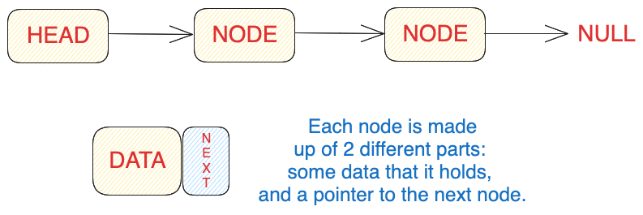

# 05 Introduction to Linked Lists

Linked lists can be thought of as a series of individual nodes, each containing some data and a reference to the next node. Each node is like a little container with its own data and a pointer to the next container. Unlike arrays, these nodes don't need to be located together in a single block of memory. They can be scattered throughout the computer's memory.

Arrays are static data structures because they require all the memory they need to be allocated upfront. If you want to add more items to an array that's already full, you need to create a new, larger array and copy all the existing items into it. This can be time-consuming and memory-intensive.

Linked lists, on the other hand, are dynamic data structures. They can grow or shrink in size as needed. Adding or removing items in a linked list is easier because you don't need to worry about finding contiguous memory blocks or copying data. You can simply rearrange the pointers in the nodes to link them correctly.

A linked list is composed of nodes. The first node in the list is called the head, and it serves as the starting point to access the rest of the list. Each node contains two things: the actual data it holds and a reference (or pointer) to the next node in the list. 



There are different types of linked lists:

- A **singly linked list** is like a line of people standing in a row, each person facing forward and holding the hand of the person in front. You can only move forward through the line.
- A **doubly linked list** is more like a circle of people holding hands, where each person holds hands with both the person in front and the person behind. This allows you to move in both directions, either clockwise or counterclockwise around the circle.
- Finally, a **circular linked list** is similar to a train on a circular track. Each train car represents a node, and it connects to the next car in a loop. You can start at any car and go around the track endlessly, visiting all the cars.

## Implementation

There are several ways to implement a linked list, and for this course, we will be focusing on the Node-as-a-class approach:

```js
class Node {
  constructor(data, next) {
    this.val = data === undefined ? 0 : data;
    this.next = next === undefined ? null : next;
  }
}
```

## Array vs. Singly Linked Lists

| Operation | Array | Linked List |
| --- | --- | --- |
| Reading | O(1) | O(N) |
| Searching | O(N) | O(N) |
| Insertion | O(N), O(1) at the end | O(N), O(1) at the beginning |
| Deletion | O(N), O(1) at the end | O(N), O(1) at the beginning |

Singly linked lists excel as a data structure for efficiently traversing an entire list while making insertions or deletions. The advantage lies in the fact that we never need to concern ourselves with shifting other data elements during these operations.

## Singly Linked Lists Problems

To tackle problems with Linked Lists, we will employ pointer-based strategies that we have learned in previous lessons. Typically, the problems will involve singly linked lists, where we do not have access to a reference of the previous node. As a result, we will frequently use two pointers: `prev`, which points to the previous node, and `curr`, which points to the current node. Sometimes, we may also require a reference to the next node, which we will store in a variable called `next`.

## Dummy Nodes

Dummy nodes are fictitious or temporary nodes that are inserted into a data structure or algorithm to assist in handling special cases or simplifying complex scenarios.

For the most part, we will use dummy nodes as a reference to a head node. By introducing a dummy node before the head, we create a stable reference point. 

By using a dummy node, we can ensure that its next pointer always points to the head node, eliminating the need to handle certain edge cases where the head node changes or is removed from the list.

## Removing nodes from a list

### Algorithm

1.	Initialize three pointers: dummy, `prev` and `curr`. Set dummy to a new node and its next pointer to `head`. Set `prev` to the dummy, and `curr` to the `head` of the linked list.
2.	Iterate through the linked list using a loop until `curr` becomes null:
    - If the value of `curr` matches the target value:
        - Set the next pointer of `prev` to `curr.next` to bypass `curr` and remove it from the list.
    - If the value of `curr` does not match the target value:
        - Update the `prev` pointer to `curr`.
    - Move the `curr` pointer to the next node.
3.	Return `dummy.next` which is the updated linked list.

### Implementation

#### Without Dummy Node

```js
function deleteFromLinkedList(head, target) {
  let prev = null;
  let curr = head;

  if (!head) {
    return head;
  }

  while (curr) {
    if (curr.val === target) {
      if (!prev) {
        head = curr.next;
      } else {
        prev.next = curr.next;
      }
    } else {
      prev = curr;
    }
    curr = curr.next;
  }

  return head;
}
```

#### With Dummy Node

```js
function removeElements(head, target) {
  let dummy = new Node();
  dummy.next = head;
  let prev = dummy;
  let curr = head;

  while (curr) {
    if (curr.val === target) {
      prev.next = curr.next;
    } else {
      prev = curr;
    }
    curr = curr.next;
  }

  return dummy.next;
}
```

## Reversing a Linked List

### Algorithm

1.	If the head of the linked list is `null`, return the head as there are no nodes in the linked list.
2.	Initialize two pointers: `prev` and `curr`. Set `prev` to null, and `curr` to `head`.
3.	Iterate through the linked list until `curr` becomes `null`:
      - Initialize the `next` variable to reference the `curr.next` node.
      - Rewire the `curr` node so that its next pointer points to the `prev` node.
      - Slide the `prev` and `curr` pointers. The `prev` node should now reference `curr`, and `curr` should reference the `next` node.
4.	Return `prev` because once `curr` becomes `null`, the `prev` node will reference the new head node.

### Implementation

```js
function reverseLinkedList(head) {
  if (!head) {
    return null;
  }

  let prev = null;
  let curr = head;

  while (curr !== null) {
    let next = curr.next;
    curr.next = prev;
    prev = curr;
    curr = next;
  }
  return prev;
}
```